# Agent Workflow Platform v0.2

**可视化多智能体工作流编排与执行平台**

一个基于 Next.js 构建的全栈平台，用于设计、执行、监控和调试多 Agent 工作流。通过可视化节点编辑器编排智能体协作流程，配合运行中心、执行追踪和分析看板，实现对 AI Agent 全生命周期的管理。

---

## Screenshots

### 仪表盘 & 项目管理

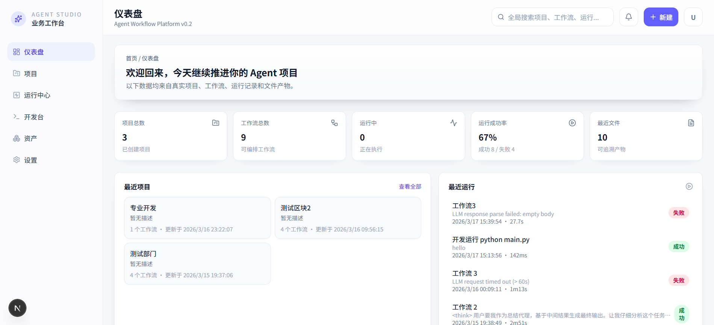

### 工作流编辑器

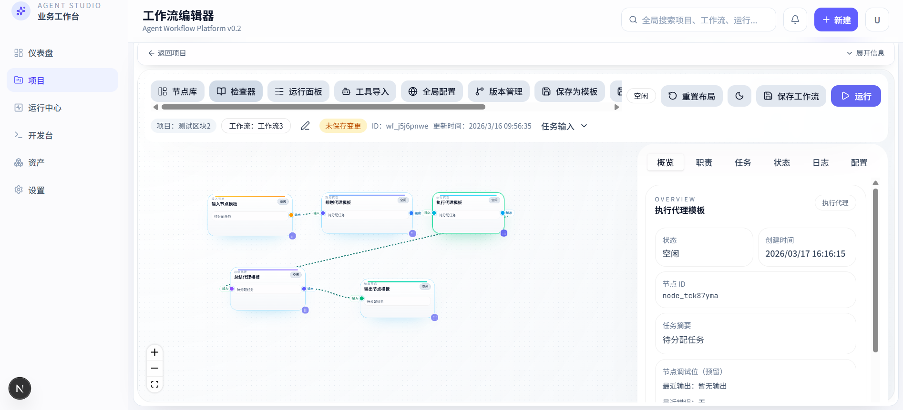

<details>
<summary>节点库 & 节点检查器</summary>

| 节点库 | 检查器 - 概览 | 检查器 - 配置 |
|--------|--------------|--------------|
| 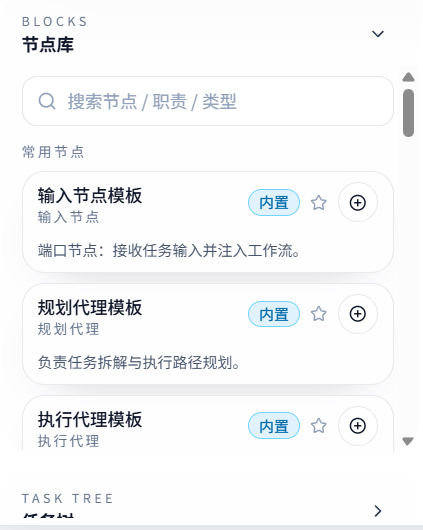 | 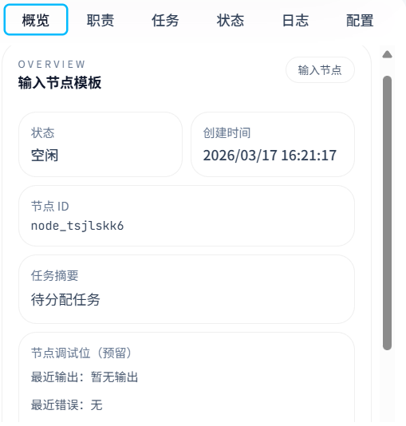 | 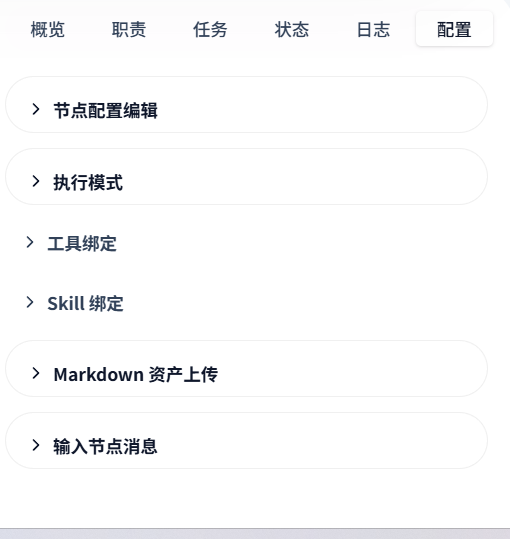 |

</details>

### 运行中心 & 分析看板

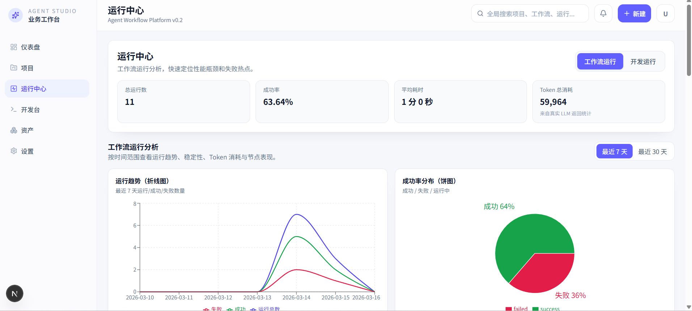

### 执行追踪 & 调试

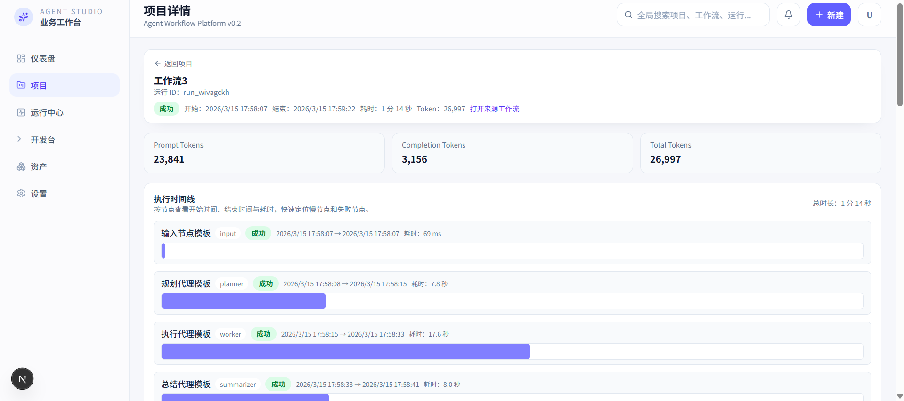

<details>
<summary>Prompt Trace & 节点 I/O</summary>

| Prompt Trace | 节点 I/O |
|-------------|----------|
| 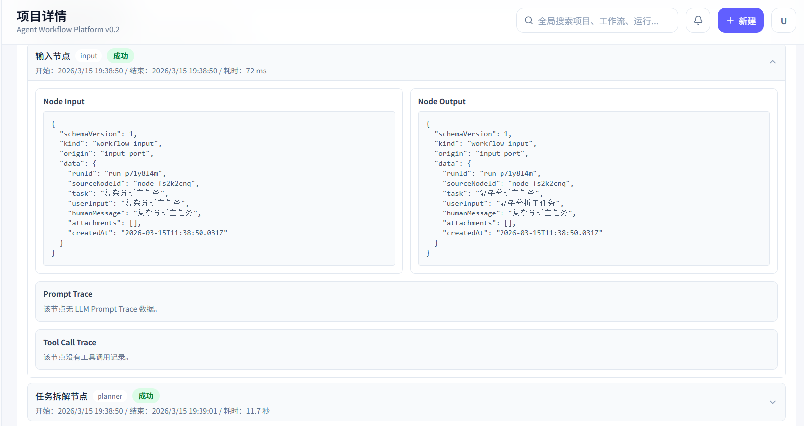 | 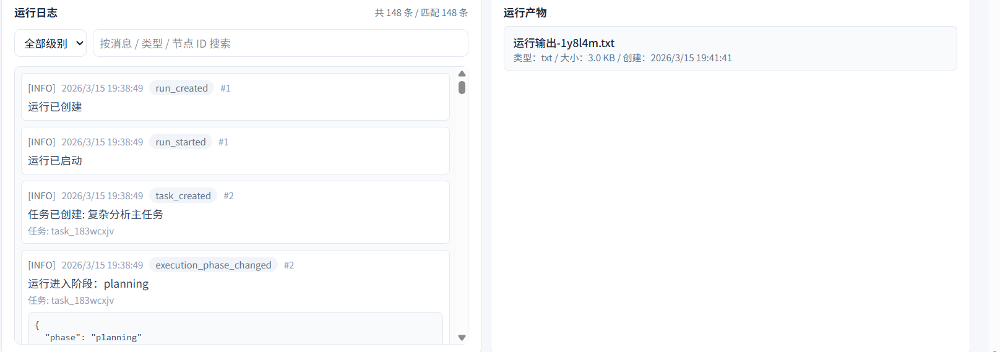 |

</details>

### 开发台 (Agent Dev)

| 工作台列表 | IDE 环境 |
|-----------|---------|
| 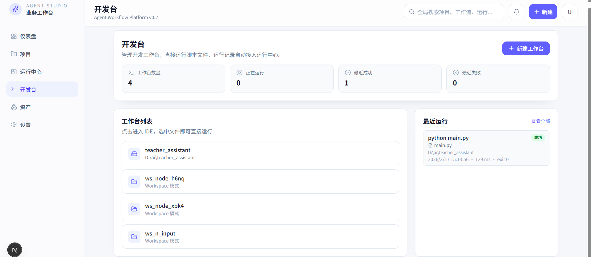 | 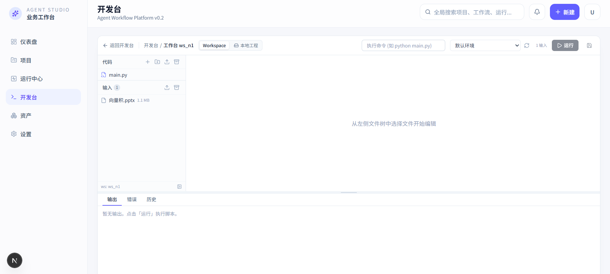 |

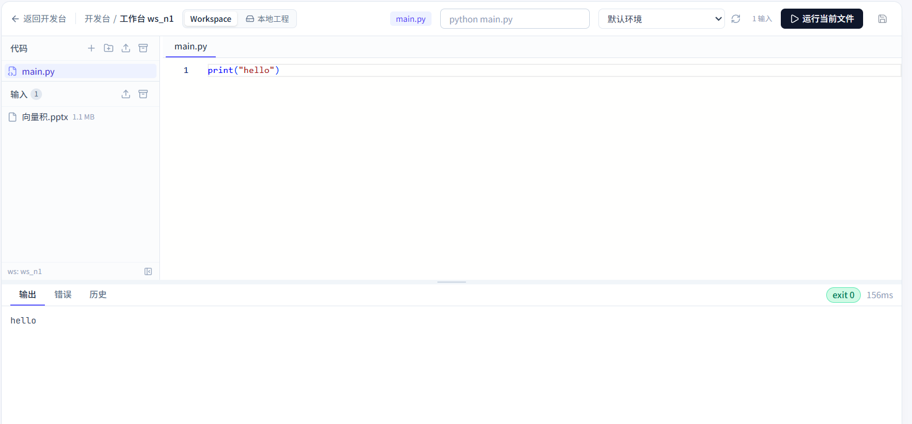

### 资产管理 & 全局功能

| 资产管理 | 创建工作流 | 全局搜索 |
|---------|-----------|---------|
| 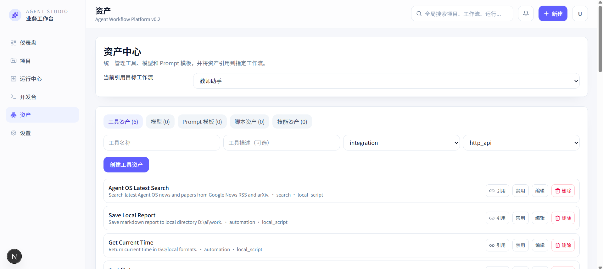 | 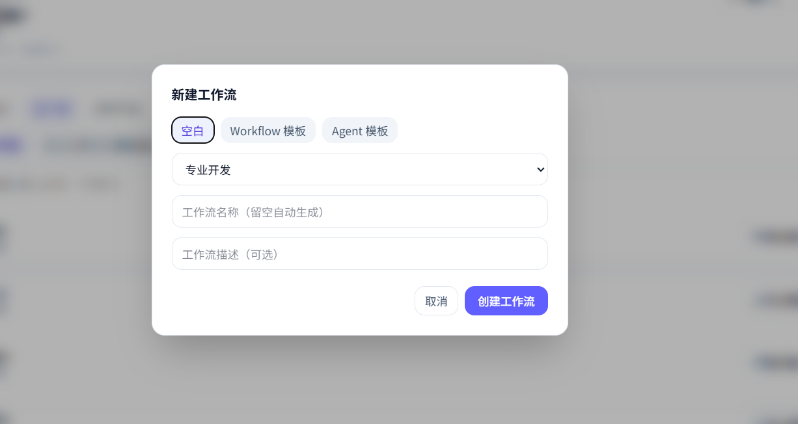 | 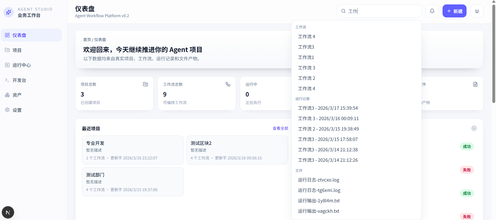 |

---

## Features

平台涵盖从项目管理到智能体开发的完整工具链：

- **可视化工作流编辑器** — 拖拽式节点画布，支持 8 种智能体角色节点的编排与连接
- **运行中心 & 分析看板** — 工作流运行/开发运行双视角，趋势图、成功率、Token 用量等多维图表
- **执行追踪 & 调试** — 执行时间线、节点 I/O 检查、Prompt Trace、Tool Call Trace
- **开发台 (Agent Dev)** — 集成 Monaco 编辑器 + 终端的 IDE 环境，直接运行脚本并追踪
- **资产管理** — 模型、Prompt 模板、工具、技能包、参考文档的统一管理
- **项目管理** — 项目 CRUD、归档、工作流版本管理、全局搜索

> 详细功能说明: [docs/FEATURES.md](docs/FEATURES.md)

---

## Tech Stack

| 层 | 技术 |
|----|------|
| 框架 | Next.js 16 (App Router) + React 19 + TypeScript 5 |
| 状态管理 | Zustand |
| 可视化 | ReactFlow (节点画布) + Recharts (图表) |
| 代码编辑 | Monaco Editor |
| 终端 | XTerm.js + node-pty |
| UI | Tailwind CSS 4 + Radix UI + Lucide Icons |
| 数据库 | SQLite (`node:sqlite`) |
| 构建 | Turbopack (开发) / Next.js Build (生产) |

> 完整技术架构: [docs/ARCHITECTURE.md](docs/ARCHITECTURE.md)

---

## Quick Start

```bash
# 克隆项目
git clone <repo-url>
cd agent-workflow-v0.2

# 安装依赖
npm install

# 启动开发服务器
npm run dev
```

打开 [http://localhost:3000](http://localhost:3000)，自动跳转到仪表盘。

```bash
# 质量校验
npm run lint
npm run test
npm run build
```

> 详细配置说明: [docs/GETTING_STARTED.md](docs/GETTING_STARTED.md)

---

## Project Structure

```
├── app/
│   ├── (platform)/          # 平台页面 (仪表盘/项目/运行/开发台/资产/设置)
│   └── api/                 # RESTful API 路由 (50+ 端点)
├── src/
│   ├── features/workflow/   # 工作流编辑器 (画布/检查器/状态管理/API 客户端)
│   ├── components/          # 通用 UI 组件 + 终端组件
│   ├── server/
│   │   ├── domain/          # 领域模型 (15 个实体定义)
│   │   ├── persistence/     # SQLite 持久化层
│   │   ├── api/             # 后端服务层
│   │   ├── agents/          # LLM 适配器 (多 Provider 支持)
│   │   ├── runtime/         # 工作流执行引擎
│   │   ├── config/          # 配置 & 内置模板
│   │   └── tools/           # 工具执行 & 绑定
│   └── lib/                 # 工具函数
├── docs/                    # 项目文档
└── .data/                   # SQLite 数据库 & 工作区文件 (运行时生成)
```

---

## Documentation

| 文档 | 说明 |
|------|------|
| [Features](docs/FEATURES.md) | 核心功能模块详解 |
| [Architecture](docs/ARCHITECTURE.md) | 技术架构与设计决策 |
| [Getting Started](docs/GETTING_STARTED.md) | 安装、配置、环境要求 |
| [Changelog](docs/CHANGELOG_CN_v0_2.md) | v0.2 变更日志 |

---

## Known Limitations (v0.2)

- 账号与权限系统为占位状态
- 通知系统为最小可用版本
- 运行 Replay / 对比尚未实现执行能力（仅 UI 预留）
- Agent Template 处于基础预留阶段

---

## 密语

大家可以自由地参与改进这个项目 🙌  
目前已经具备了一些基础功能，但整体深度和完整性还有很大的提升空间。  
如果你觉得这个项目对你有帮助，或者打算拿去使用的话，欢迎点个 ⭐ 支持一下～爱你们呦！  
这对正在找相关方向实习的我来说真的非常重要，感谢大家！  
如果在使用过程中遇到任何问题，或者有改进建议，欢迎随时提 issue，我会尽快跟进修复和优化。  
如果后续使用的人多了，也会考虑建一个交流群方便大家一起讨论。  
这个项目最初是想复刻类似 ComfyUI 的 workflow 形态，但在实现过程中逐渐发现还有很多细节和能力需要补齐。  
后面也会持续迭代，在可扩展性、稳定性以及整体设计上进一步完善。  

---

## License

MIT
