# Agent Workflow Platform v0.2

**面向 Agent 研发、编排、运行、评测与演示的一体化平台**

这是一个基于 Next.js 构建的全栈 Agent 平台，用来解决多智能体系统从“能跑”到“可编排、可观测、可评测、可恢复、可演示”的完整工程问题。平台覆盖项目管理、可视化 Workflow 编排、运行中心、Meta-Agent、自主恢复控制、评测体系、Agent Dev、资产中心、设置中心与 Showcase 演示台。

---

## 平台概览

平台当前已经形成一条相对完整的 Agent 生命周期闭环：

- **项目管理**：按项目隔离工作流、运行记录、文件与资产
- **Workflow 编排**：可视化搭建多节点 Agent 流程，支持节点配置、工具绑定、人工输入、版本管理
- **运行与调试**：运行中心、执行时间线、Prompt Trace、Tool Call Trace、节点 I/O、Runtime Control
- **Meta-Agent**：基于 Todo / Wave / Review / Recovery / Replan 的自主规划与执行系统
- **评测体系**：Suite / Case / Run 三层评测模型，支持批量回放、横向对比与结果报告
- **Agent Dev**：内置 Monaco + XTerm 的开发模式，支持工作区脚本开发与追踪
- **资产与设置**：模型、Prompt、工具、Skill、模板、凭证、通知等平台级配置统一管理
- **Showcase 演示台**：为面试、汇报和场景演示准备的可启动 Demo Assets 与 Runbook

---

## 功能矩阵

| 模块 | 关键能力 | 当前截图状态 |
|------|----------|--------------|
| 仪表盘 | 全局统计、最近项目、最近运行、最近文件、高亮入口 | 已有 |
| 项目管理 | 项目 CRUD、归档、项目详情、工作流/运行/文件聚合 | 需补项目页截图 |
| Workflow 编辑器 | ReactFlow 画布、节点库、检查器、配置、发布 | 已有 |
| 运行中心 | 运行总览、趋势分析、成功率、Token 分析、筛选检索 | 已有 |
| 运行详情 | Timeline、Prompt Trace、Tool Trace、节点 I/O、运行控制信号 | 已有基础图，建议补控制面截图 |
| Meta-Agent | Session Center、Mission Control、Control Plane、Recovery、Trace、Execution Map | 需补 |
| 评测体系 | Suite / Case / Run / Report / Compare | 需补 |
| Agent Dev | 工作台、IDE、文件树、终端、脚本运行 | 已有 |
| 资产中心 | 模板、模型、Prompt、工具、Skill、参考资产 | 已有 |
| 设置中心 | 默认模型、凭证、通知通道、项目继承预览 | 需补 |
| Showcase | 场景选择、Runbook、Provision / Launch、演示入口 | 需补 |
| 全局能力 | 全局搜索、快速新建、通知与凭证配置 | 已有部分，建议补设置图 |

完整截图建议见：[docs/SCREENSHOT_GUIDE.md](docs/SCREENSHOT_GUIDE.md)

---

## Screenshot Gallery

### 1. 仪表盘

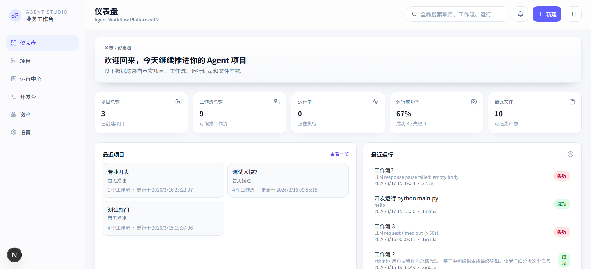

展示重点：
- 平台入口是否完整
- 是否具备“项目 + 运行 + 文件”统一概览
- 是否已经形成可运营的总览页

### 2. Workflow 编辑器

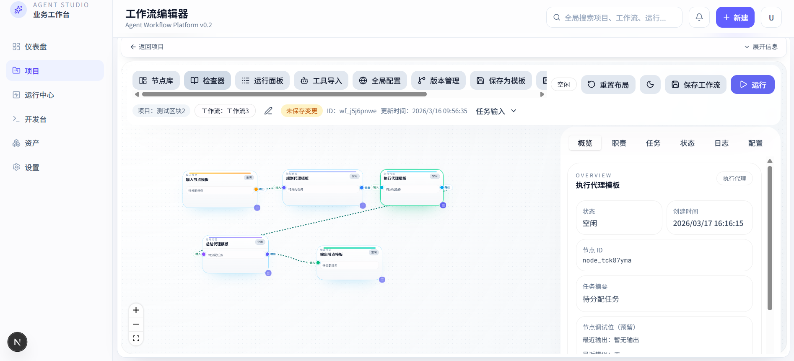

<details>
<summary>节点库与节点检查器</summary>

| 节点库 | 检查器 - 概览 | 检查器 - 配置 |
|--------|---------------|----------------|
| 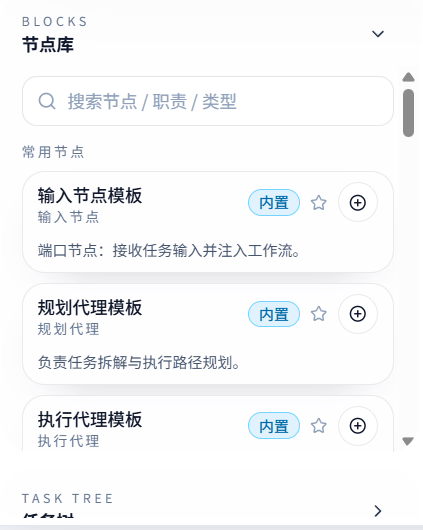 | 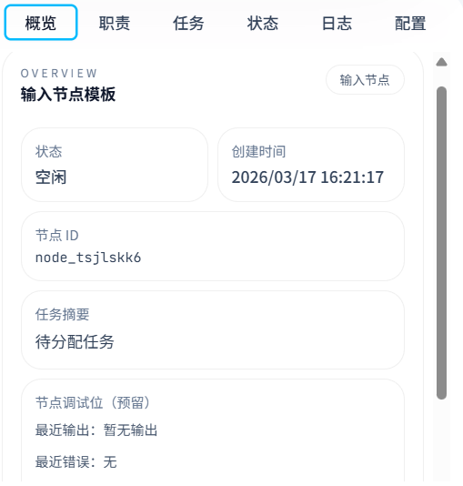 | 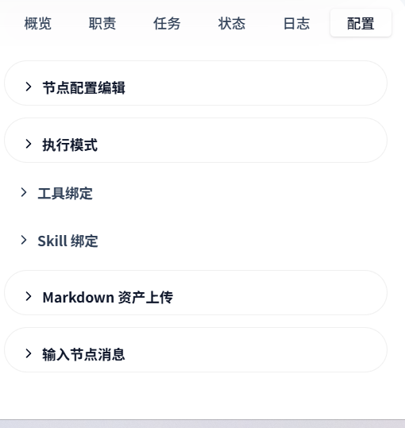 |

</details>

展示重点：
- 拖拽式节点编排能力
- 节点角色、职责、Prompt、模型、工具、Skill 的配置深度
- 平台不是“聊天页”，而是可操作的 Agent Workflow IDE

### 3. 运行中心

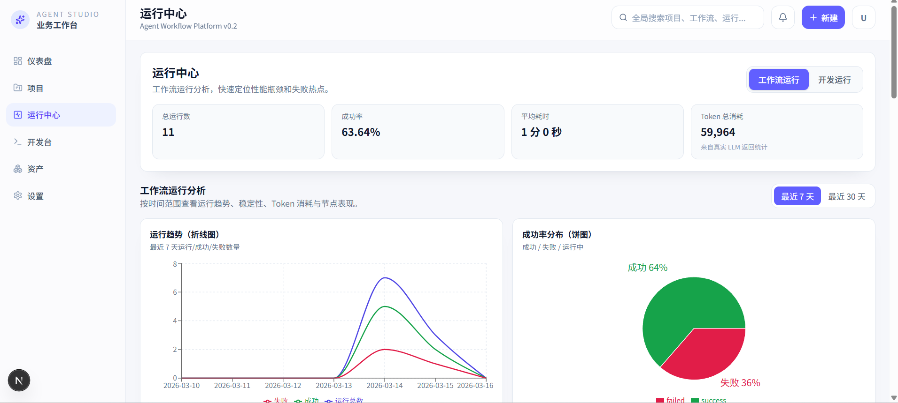

展示重点：
- 运行数量、成功率、趋势、Token 等多维分析
- 工作流运行与开发运行的统一观测
- 平台具有生产态运行管理能力

### 4. 执行追踪与调试

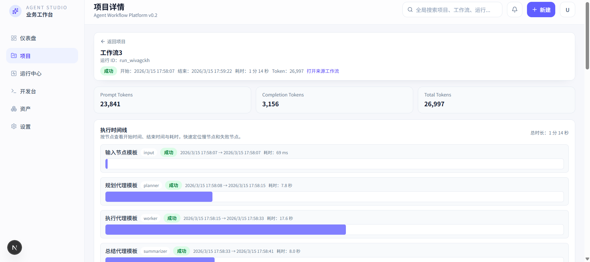

<details>
<summary>Prompt Trace 与节点 I/O</summary>

| Prompt Trace | 节点 I/O |
|-------------|----------|
| 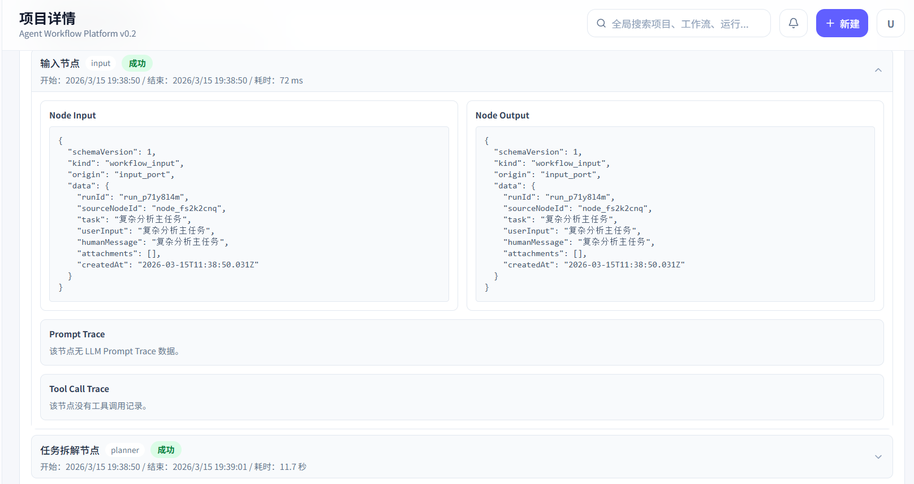 | 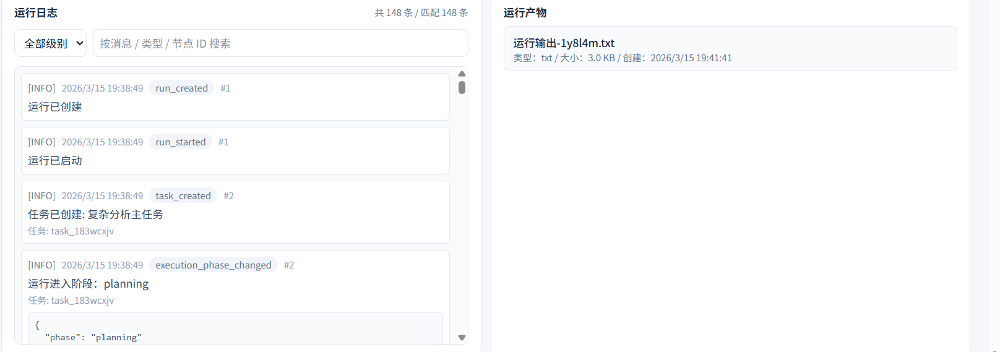 |

</details>

展示重点：
- 执行时间线与节点级追踪
- Prompt Trace / Tool Trace / 节点 I/O 的白盒调试能力
- 适合展示“不是黑盒调用，而是可观测运行系统”

### 5. Agent Dev

| 工作台列表 | IDE 环境 |
|-----------|----------|
| 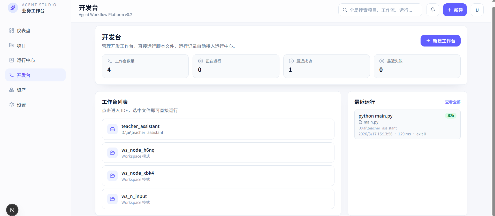 | 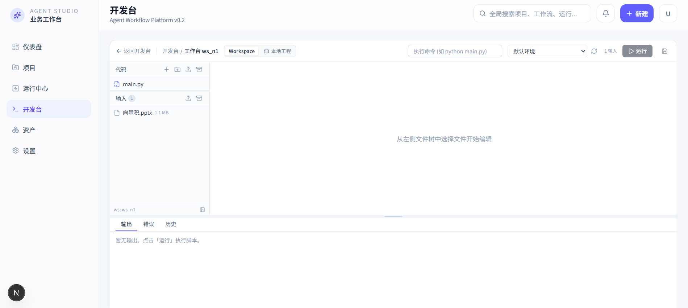 |

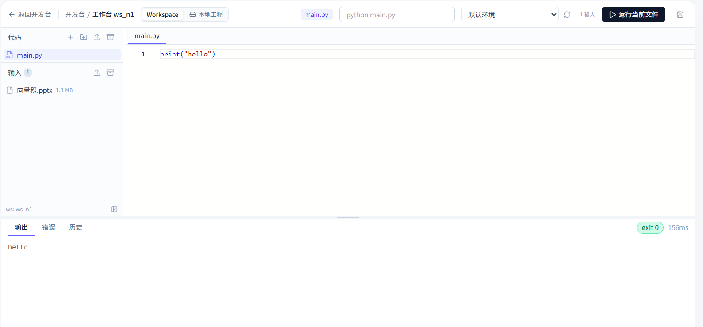

展示重点：
- 内置开发工作台与脚本执行环境
- 平台既能编排 Workflow，也能支持 Agent 本地/工作区开发
- 能力不止在运行层，也覆盖研发态

### 6. 资产中心与全局功能

| 资产管理 | 创建工作流 | 全局搜索 |
|---------|-----------|---------|
| 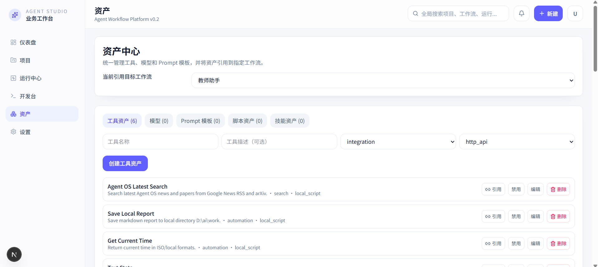 | 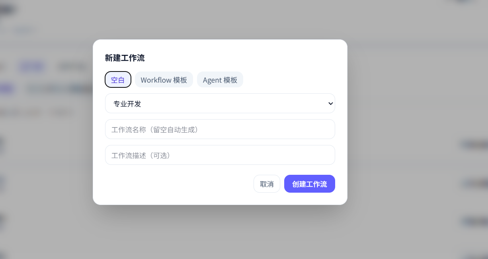 | 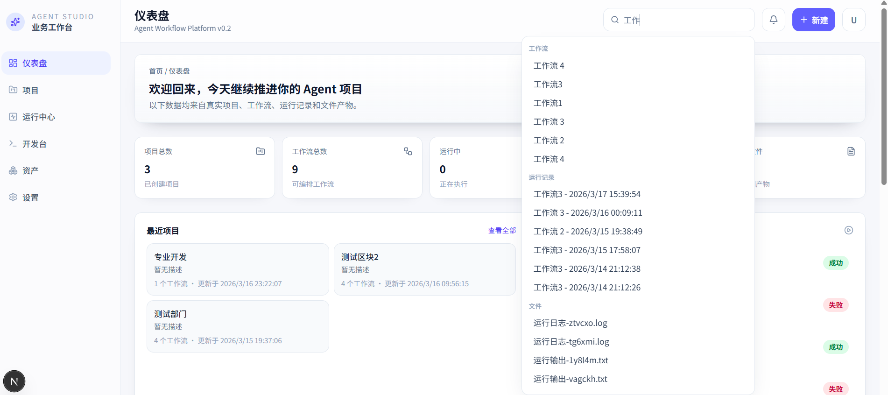 |

展示重点：
- 资源不是散落配置，而是统一资产化管理
- 快速新建与全局搜索增强平台使用效率

---

## 建议补充的高价值截图

下面这些是当前 README 最值得新增的截图，建议按文档里的命名统一补齐：

| 建议文件名 | 页面 / 路由 | 建议展示内容 |
|-----------|-------------|--------------|
| `projects-page.png` | `/projects` | 项目列表、搜索/筛选、项目卡片 |
| `project-detail.png` | `/projects/{projectId}` | Workflow / Runs / Files 聚合、Meta-Agent Activity |
| `run-detail-control-plane.png` | `/projects/{projectId}/runs/{runId}` | Timeline + Runtime Control / Replay / Checkpoints |
| `meta-agent-overview.png` | `/meta-agent` | Mission Control、Session Center、Runtime Signals |
| `meta-agent-control-plane.png` | `/meta-agent` | Control Plane、Recovery、Checkpoints、Replay Candidates |
| `meta-agent-trace.png` | `/meta-agent` | Execution Trace、Todo / Wave / Issues / Artifacts |
| `evaluations-page.png` | `/evaluations` | Suite / Case / Run / Report 面板 |
| `settings-page.png` | `/settings` | 默认模型、凭证、通知通道、继承预览 |
| `showcase-console.png` | `/showcases` | 场景选择、Runbook、Launch Real Demo、最新结果 |

详细机位和构图建议见：[docs/SCREENSHOT_GUIDE.md](docs/SCREENSHOT_GUIDE.md)

---

## 最近重点增强

### Meta-Agent：从“能跑”升级到“可控制”

- 基于 Todo / Wave 的运行时调度
- 支持 LLM-as-Judge、Recovery、Reroute、Split、Replan
- 前端已提供 Mission Control、Control Plane、Replay Candidates、Execution Trace、Execution Map
- 具备更明确的运行治理与可观测能力，而不是单纯的 prompt 链路

### Runtime & Memory：从“上下文拼接”升级到“分层记忆”

- Working Memory：按 token budget 组装上下文
- Long-term Memory：支持 embedding 检索、去重、衰减、合并
- Project / Meta-Agent Memory：沉淀 planner / routing / review / recovery 经验
- 支持 checkpoint、恢复路径、输出资产化管理

### Evaluation：从“人工看结果”升级到“结构化回归评测”

- Suite / Case / Run 三层模型
- 支持批量执行、结果报告、回放与横向对比
- 配合运行追踪，可定位质量退化到底发生在哪一层

### Showcase：从“说明文档”升级到“可启动演示资产”

- 内置多套可展示的场景化演示
- 支持 Provision / Launch Real Demo
- 更适合面试、汇报与对外演示

---

## 核心功能模块

### 1. Dashboard

- 平台总览统计
- 最近项目 / 最近运行 / 最近文件
- 快速进入高频功能页面

### 2. Projects

- 项目创建、归档、删除、筛选
- 项目详情聚合工作流、运行、文件
- 面向业务场景做多项目隔离

### 3. Workflow Editor

- 基于 ReactFlow 的可视化编排
- 支持节点添加、连线、职责配置、Prompt 配置、模型配置、工具/Skill 绑定
- 支持人工输入、版本发布与运行

### 4. Run Center & Run Detail

- 全局运行分析看板
- Execution Timeline
- Prompt Trace / Tool Trace / 节点 I/O
- Runtime Control、Checkpoints、Replay Candidates

### 5. Meta-Agent

- 输入目标后自动规划 Todo 图
- 运行时支持 Selection、Wave、Delegation、Review、Recovery、Replan
- 页面上可查看会话中心、控制平面、恢复信号、记忆与轨迹

### 6. Evaluations

- 评测套件、评测用例、评测执行记录
- 批量评测、结果报告、对比分析
- 适合做回归验证与质量门禁

### 7. Agent Dev

- 工作区 / 本地项目双模式
- Monaco 编辑器 + 文件树 + XTerm
- 一键运行脚本并纳入平台追踪

### 8. Assets

- 工作流模板、节点模板、模型、Prompt 模板、工具、Skill、参考资料统一管理
- 提升复用性和平台化治理能力

### 9. Settings

- 默认 Provider / Model / BaseUrl / Credential
- 凭证创建与管理
- 通知通道与项目继承预览

### 10. Showcases

- 面向面试 / 汇报的场景化演示台
- 支持 Runbook 展示与真实 Demo 启动

---

## 技术栈

| 层 | 技术 |
|----|------|
| 前端框架 | Next.js 16 (App Router) + React 19 + TypeScript 5 |
| 状态管理 | Zustand |
| 可视化 | ReactFlow + Recharts |
| 编辑器与终端 | Monaco Editor + XTerm.js + node-pty |
| UI | Tailwind CSS 4 + Radix UI + Lucide |
| 后端形态 | Next.js Route Handlers + 服务层单体架构 |
| 执行引擎 | Workflow Runtime + Meta-Agent Runtime |
| 持久化 | SQLite (`node:sqlite`) |
| 记忆系统 | Working Memory + Long-term Memory + Project Memory |

完整架构说明见：[docs/ARCHITECTURE.md](docs/ARCHITECTURE.md)

---

## 快速开始

```bash
git clone <repo-url>
cd agent_workflow_v0_2
npm install
npm run dev
```

打开 [http://localhost:3000](http://localhost:3000) 即可进入平台。

质量校验：

```bash
npm run lint
npm test
npm run build
```

更多配置说明见：[docs/GETTING_STARTED.md](docs/GETTING_STARTED.md)

---

## 页面地图

| 页面 | 路由 | 说明 |
|------|------|------|
| 仪表盘 | `/dashboard` | 平台首页与全局概览 |
| 项目列表 | `/projects` | 项目管理入口 |
| 项目详情 | `/projects/{projectId}` | 单项目工作流/运行/文件总览 |
| 工作流编辑 | `/projects/{projectId}/workflows/{workflowId}` | 可视化编排与节点配置 |
| 运行中心 | `/runs` | 运行分析与检索 |
| 运行详情 | `/projects/{projectId}/runs/{runId}` | 时间线、Trace、控制面 |
| Meta-Agent | `/meta-agent` | 规划、执行、控制、恢复 |
| 评测中心 | `/evaluations` | Suite / Case / Run / Report |
| Agent Dev | `/agent-dev` | 开发工作台入口 |
| 资产中心 | `/assets` | 模板、模型、Prompt、工具、Skill |
| 设置中心 | `/settings` | 默认模型、凭证、通知等 |
| Showcase | `/showcases` | 面向演示的场景台 |

---

## 项目结构

```text
app/
  (platform)/                # 平台页面
  api/                       # Route Handlers
src/
  components/                # 通用组件
  features/workflow/         # Workflow 前端模块
  features/showcase/         # Showcase 前端模块
  server/
    api/                     # 后端服务
    runtime/                 # 工作流执行引擎
    meta-agent/              # Todo-driven Meta-Agent
    evaluation/              # 评测体系
    memory/                  # 工作记忆 / 长期记忆 / 向量检索
    tools/                   # 工具系统
    config/                  # 配置与模板
    persistence/             # SQLite 持久化
docs/
  screenshots/               # README 截图素材
  *.md                       # 架构、功能、设计方案文档
```

---

## 文档索引

| 文档 | 说明 |
|------|------|
| [docs/FEATURES.md](docs/FEATURES.md) | 核心模块与能力清单 |
| [docs/ARCHITECTURE.md](docs/ARCHITECTURE.md) | 平台架构与分层说明 |
| [docs/GETTING_STARTED.md](docs/GETTING_STARTED.md) | 安装与环境配置 |
| [docs/CHANGELOG_CN_v0_2.md](docs/CHANGELOG_CN_v0_2.md) | 版本更新记录 |
| [docs/SCREENSHOT_GUIDE.md](docs/SCREENSHOT_GUIDE.md) | README / 展示用截图清单 |
| [docs/interview_showcase_scenarios.md](docs/interview_showcase_scenarios.md) | 面试展示场景脚本 |

---

## 当前边界

- 当前仍以单机 SQLite 作为主要持久化底座
- 多用户鉴权与租户隔离尚未完整实现
- 分布式部署与高并发场景还有进一步演进空间
- 部分新模块已经上线，但仍需补齐更多高质量页面截图

---

## License

MIT
